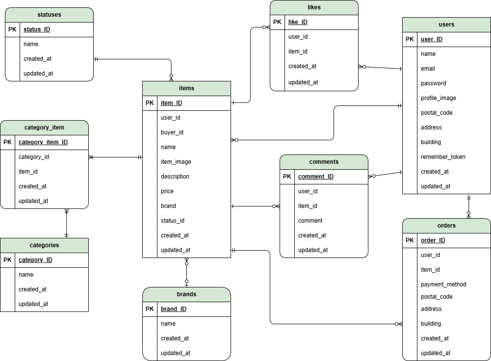

# coachtechフリマ


## 環境構築

### Dockerビルド

1. `git clone git@github.com:yoki229/COACHTECHfurima.git`
2. DockerDesktopアプリを立ち上げる
3. `cd COACHTECHfurima`
4. `docker-compose up -d --build`

> MacのM1・M2チップのPCの場合、no matching manifest for linux/arm64/v8 in the manifest list entriesのメッセージが表示されビルドができないことがあります。 エラーが発生する場合は、docker-compose.ymlファイルの「mysql」内に「platform」の項目を追加で記載してください
```
mysql:
    platform: linux/x86_64(この文追加)
    image: mysql:8.0.26
    environment:
```
code .
### Laravel環境構築

1. `docker-compose exec php bash`
2. `composer install`
3. `exit`
4. `cp src/.env.example src/.env`
   (.env.exampleファイルから.envを作成)
5. 環境変数を変更
```
DB_CONNECTION=mysql
DB_HOST=mysql
DB_PORT=3306
DB_DATABASE=test_db
DB_USERNAME=test_user
DB_PASSWORD=test_pass
```
5. アプリケーションキーの作成
```
docker-compose exec php bash
php artisan key:generate
```
6. マイグレーションの実行
```
php artisan migrate
```
7. シーディングの実行
```
php artisan db:seed
```

## 使用技術

- PHP 8.1
- Laravel 8.6
- MySQL 8.0.26

## テーブル仕様


## ER図




## URL

- 開発環境：http://localhost/
- phpMyAdmin：http://localhost:8080/
